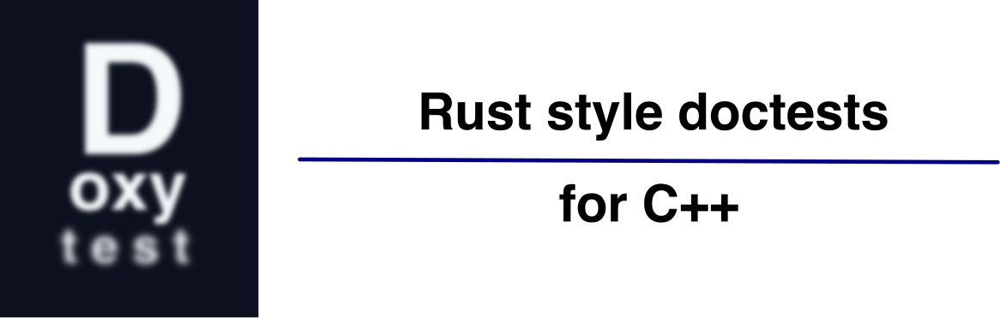

<p align="center"></p>

# Introduction

**Doxytest** is a tool for generating C++ test programs from code embedded in header file comments.

Its inspiration is a [Rust][] feature called [doctests][].

A doctest is a snippet of sample code in the documentation block above a function or type definition.
In Rust, the example becomes part of the documentation generated by the `cargo doc` command.

However, in Rust, doctests are not just part of the documentation; they are also used to generate test programs.
The `cargo test` command collects doctests from all the project's modules by looking for comments containing triple backtick fenced code blocks. The extracted code is then compiled and run as a test program.

Looking through the source code of Rust crates, you will see _lots_ of embedded doctests. Code in `Examples` sections is usually crafted as tests using Rust's `assert!` and `assert_eq!` macros.

After using this feature in Rust for a while, I wanted to do the same thing in C++. I decided to write a Python script that would extract the code snippets from the comments in C++ header files and use them to generate standalone C++ test programs.

The Doxytest script, [`doxytest.py`][] looks for comment lines in C++ header files that start with `///` and which contain a fenced code block --- a _doctest_. The script extracts the doctests, wraps them in `try` blocks to catch any failures, and then embeds them in a standalone test program.

Of course, for this to be useful, doctest code must be formulated as a test. To that end, Doxytest also supplies [assertions][] that you can use in your doctests. These are relatively simple macros that capture the values of the arguments passed to an assertion along with some other helpful information. They throw a particular exception if the assertion fails, and the test program captures and processes that exception. The assertion macros are automatically defined and included in every test program generated by `doxytest.py`.

Doxytest also supplies [`doxytest.cmake`][], a CMake module that automates the process of extracting tests from comments in header files and adding build targets for the resulting test programs. It defines a single CMake function called `doxytest` which is a wrapper around the `doxytest.py` script.

## Installation

The main script file is `doxytest.py`, which you can copy and use on a standalone basis.

If you use CMake then copy both `doxytest.cmake` and `doxytest.py` to the same directory.
By default, `doxytest.cmake` expects that the Python script is located in the same directory it is.
The `doxytest` function defined in the module has an option to change that default.

Typical CMake projects have a top-level `cmake/` subdirectory for their CMake modules which is a good place to store `doxytest.cmake` and `doxytest.py` .

## Documentation

Doxytest comes with complete [documentation](https://nessan.github.io/doxyhtest).
We generated the site using [Quarto](https://quarto.org).

## A Simple Example

Here is a super complicated C++ header file `add.h` with a comment block containing a code snippet:

````cpp
/// @brief Adds two numbers together.
///
/// # Examples
/// ```
/// assert_eq(add(1, 2), 3);
/// ```
constexpr int add(int a, int b) { return a + b; }
````

The header comment is the thing you might pass to [Doxygen][] to generate documentation for the function. Even if you don't use Doxygen (I prefer not to myself), most code editors will happily consume documentation like this and show it in a nicely formatted _tool tip_ if a user hovers over the `add` function in any code that uses it. This is similar in spirit to using the `crate doc` command in Rust.

The comment contains a fenced code block (wrapped in triple backticks) that illustrates how you might use the `add` method. That, by itself, is a valuable piece of documentation.

However, it is more than that, as the example is a test using assertions. Doxytest supplies the `assert_eq` macro you can use to assert that two values are equal. On failure, it prints the values of the arguments and may terminate the program. All `doxytest.py` generated test source files have the macro definition.

You can turn the _doctest_ into the source for an actual test program by invoking the `doxytest.py` script on the header file:

```sh
doxytest.py add.h
```

Which outputs `Generated test file: doxy_add.cpp with 1 test cases.` and creates the source file `doxy_add.cpp`.

If you look at `doxy_add.cpp`, you will see there is an include directive for `add.h`, as well as the definition of `assert` and `assert_eq`, along with a main program.

You can compile the test program using your favourite C++ compiler, for example, using `g++`:

```sh
g++ -std=c++23 -o doxy_add doxy_add.cpp
```

**NOTE:** The `doxyscript` generated test source uses `std::println` and friends, so typically you need to invoke the compiler with an appropriate level of "modernity".

Running `./doxy_add` gives output along the lines:

```txt
Running 1 tests extracted from: `add.h`
test 1/1 (add.h:4) ... pass
[add.h] All 1 tests PASSED
```

## Doctests

Why bother with documentation tests?

Rust has a published set of [documentation conventions][] and those suggestions are followed closely by the Rust community. This result is a very consistent documentation style for the many thousands of crates on the [crate docs][] site.

The conventions make sense for any coding language. One suggestion is always to include an "Examples" section in the comments with working code examples. Using Markdown, the code is enclosed in a triple-backtick-delimited block, allowing users to cut and paste to get a practical taste of how to use a particular type or function.

An examples section is obviously a great idea. Indeed, in C++, it is a key feature of [cppreference][], which is the reference everyone uses for the standard library.

It took a Rust brainwave to realise that it makes good pedagogical sense to format examples as tests! You get standardised documentation _and_ some tests for the price of one ticket!

Rust has some standard macros for making assertions, which makes it easy to write documentation examples as tests. For the most part, you can write an awful lot of practical test examples using `assert!` and `assert_eq!` (in Rust, macro names end in an exclamation mark). The two macros are nothing special and work precisely as you'd expect.

C++ has a rather rudimentary `assert` macro, which it inherited from the early days of C. That macro is not very useful for testing because it does not print the values of the arguments that failed the assertion. For this reason, in the `doxytest` generated code, we overwrite the existing' assert' with our own version and also provide the `assert_eq` macro, as used in our example. The two macros are automatically defined and included in the test programs generated by `doxytest.py`. They only have an effect in test code extracted from triple backtick fenced comment blocks.

## Scope

Doxytest is a simple tool for generating C++ test programs from code embedded in header file comments.
It isn't a replacement for a full-blown testing framework, such as [`Catch2`][] or [`Google Test`][].

Doctests are typically just a few lines of code that primarily illustrate how to use a function or class and are crafted as tests. You're unlikely to write a lot of complicated edge case code as comments in a header file.

On the other hand, once you get used to the idea, you tend to write a doctest for almost every function or class you write.
So, while the depth of test coverage may not be as high as that of a full-blown testing framework, the breadth of coverage is impressive.

The breadth of coverage is very valuable when adding new features or fixing bugs. Just compiling all the doctests can serve as a quick sanity check to see if you have inadvertently broken something else. And, of course, running the tests will help you catch at least basic regression errors.

If you are using Rust in an IDE like [VSCode][], you can run the doctest for an individual method by clicking a discrete "Run" above the method in the IDE. There is also a "Run" button above a type definition that runs all the doctests for that type.

We haven't implemented a `doxytest` extension for VSCode yet. However, we do have a CMake module, [`doxytest.cmake`][], that can automate the process of extracting those tests and adding build targets for each resulting test program. This is already very useful and, if you are using the CMake Tools extension for [VSCode][], it will let you easily run doctests at the click of a button.

### Contact

You can contact me by [email](mailto:nzznfitz+gh@icloud.com).

### Copyright and License

Copyright (c) 2025-present Nessan Fitzmaurice. \
You can use this software under the [MIT license](https://opensource.org/license/mit).

<!-- Reference links -->

[Rust]: https://www.rust-lang.org
[doctests]: https://doc.rust-lang.org/rustdoc/write-documentation/documentation-tests.html
[documentation conventions]: https://doc.rust-lang.org/book/ch14-02-publishing-to-crates-io.html#listing-14-1
[crate docs]: https://docs.rs
[cppreference]: https://cppreference.com
[Doxygen]: https://www.doxygen.nl
[`Google Test`]: https://github.com/google/googletest
[`Catch2`]: https://github.com/catchorg/Catch2
[VSCode]: https://code.visualstudio.com
[assertions]: https://nessan.github.io/doxytest/pages/script/assertions.html
[`doxytest.py`]: https://nessan.github.io/doxytest/pages/script
[`doxytest.cmake`]: https://nessan.github.io/doxytest/pages/cmake
