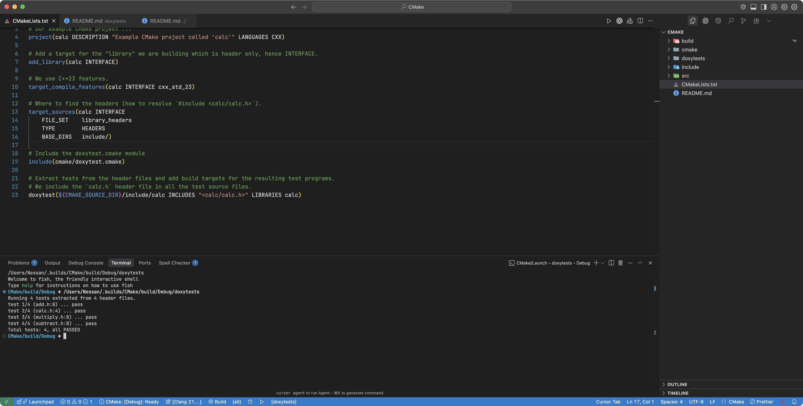
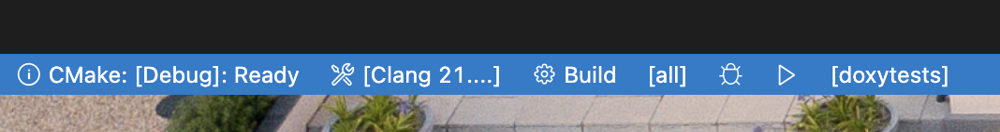
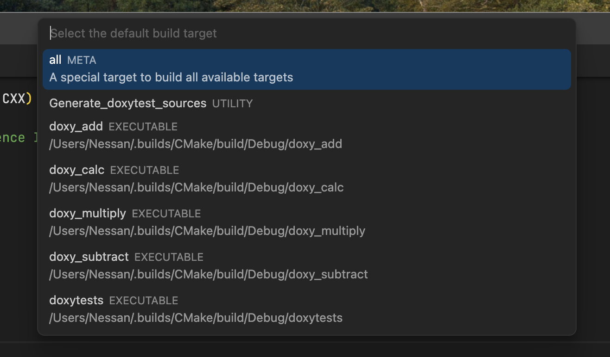
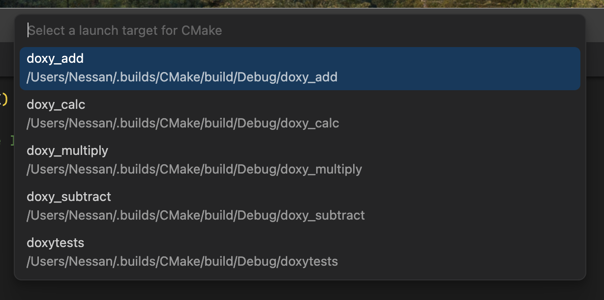

## Introduction

`doxytest.cmake` is a CMake module that automates the process of extracting tests from documentation and adding build targets for the resulting test programs.
It defines a single CMake function called `doxytest` which is a wrapper around the {doxytest.script} script.

## Usage

Here is an example of how to use the module in your `CMakeLists.txt` file to extract and then build test programs from comments in two header files, ' include/foo.h` and `include/bar.h`:

```cmake
include(doxytest)                                      # <1>
doxytest(include/project/foo.h include/project/bar.h)  # <2>
```
1. We are assuming that the `doxytest.cmake` module is in the same directory as the `CMakeLists.txt` file. <br>
 The `doxytest.cmake` module defines a single CMake function called `doxytest`.
2. We are using the `doxytest` function with all default settings. <br>
 See the [Reference](#reference) section for more details on the many options you can pass to this function.

Assuming everything goes well, CMake builds will generate  two test source files:

- `doxytests/doxy_foo.cpp`
- `doxytests/doxy_bar.cpp`

Note that the default output directory for the test source files is `doxytests/`.
The script creates the directory if necessary.
Also note that, by default, each test source file has a name that has a prefix (by default, `doxy_`) followed by the base name of the source file for the doctests.

The `doxy_foo.cpp` source file will have an include directive for the `foo.h` header file, and the `doxy_bar.cpp` source file will have an include directive for the `bar.h` header file.
The path to the header files is relative to the location of the test source file, so something like:

```cpp
#include "../include/project/foo.h"   // <1>
```
1. The first `..` gets you up to the project root directory from `doxytests/`. The rest of the path identifies the header file.

TIP: Generally, you will want to include other header files in the test source files. You achieve this by passing the `INCLUDES` option to the `doxytest` function.
You will also usually need to link the test executables to other libraries. The `LIBRARIES` option handles that.
Those options, along with many others, are discussed in the [Reference](#reference) section below.

The function creates build targets for the test programs called:

- `doxy_foo`
- `doxy_bar`

By default, the `doxytest` function also creates a third source file `doxytests/doxytests.cpp` with a build target called `doxytests`.
That source file combines the tests from all the header files into a single test program.

Finally, the `doxytest` function creates a `Generate_doxytest_sources` target. Building that target forces the regeneration of the test source files.

## Reference

The `doxytest` CMake function uses the following syntax:

```cmake
 doxytest(HEADER_PATH [HEADER_PATH ...]
 [DOXY_DIR <dir>]
 [DOXY_PREFIX <prefix>]
 [INCLUDES <file1> <file2> ...]
 [LIBRARIES <lib1> <lib2> ...]
 [SILENT]
 [DOXY_MODE <mode>]
 [DOXY_COMBINED_NAME <basename>]
 [DOXY_MAX_FAILS <count>]
 [SCRIPT <path to the doxytest.py script>])
```

You must specify at least one header file or directory.

If a specified path is a directory, we will scan for all header files in that directory and its subdirectories.
The `.h` and `.hpp` extensions identify header files.

The following options are available:

- `DOXY_DIR <dir>`: The directory where our script will create the test source files.
- `DOXY_PREFIX <prefix>`: The prefix for the generated test source filenames.
- `INCLUDES <file1> <file2> ...`: A list of header files to include in the generated test source files.
- `LIBRARIES <lib1> <lib2> ...`: A list of libraries to link to the test executables.
- `DOXY_MODE <mode>`: The mode to use for the generated test source files. Valid modes are:
  - `PER_HEADER`: Just generate individual test files (doxy_Foo.cpp, doxy_Bar.cpp, etc.).
  - `COMBINED`: Generate a single test file containing all tests (doxytests.cpp by default).
  - `BOTH`: Generate both individual tests and a combined test file (this is the default).
- `DOXY_COMBINED_NAME <basename>`: The basename for the generated combined test source file.
- `DOXY_MAX_FAILS <count>`: The maximum number of allowed test failures in a single test program before it exits.
- `SILENT`: Suppress progress messages from the script.
- `SCRIPT <path to the doxytest.py script>`: The path to the `doxytest.py` script.

### `DOXY_DIR <dir>`

The directory where our script will write the test source files, which by default is `doxytests/`

```cmake
doxytest(include/foo.h DOXY_DIR tests/)
```
This will generate test files in the top-level `tests/` subdirectory.
This directory is relative to the `CMAKE_SOURCE_DIR`.

If necessary, the script creates the directory; otherwise, the module will error out if the operation fails or if the directory is not writeable.

### `DOXY_PREFIX <prefix>`

The prefix for the generated test source filenames.
By default, a header file called `Foo.h` will generate a test file called `doxy_Foo.cpp`.
You can change this by passing the `DOXY_PREFIX` option:

```cmake
doxytest(include/foo.h DOXY_PREFIX test_)
```

This will generate test files with the `test_` prefix, so `test_Foo.cpp` instead of `doxy_Foo.cpp`.

### `INCLUDES <files>`

You will often want to include other header files in the test source files.
For example, if you are testing a library called `my_lib`, you may have an include-the-lot header file `my_lib.h` that you need for the tests to compile. Use the`INCLUDES` option to the `doxytest` function to achieve this:

```cmake
doxytest(include/foo.h INCLUDES "<my_lib/my_lib.h>")
```

This will include `<my_lib/my_lib.h>` in all the test source files.
The `INCLUDES` option can be given a list of multiple header files to include.

WARNING: All included headers should have header guards or a `#pragma once` directive to prevent multiple definitions.

### `LIBRARIES <libs>`

Another commonly used option.
It allows you to specify a list of libraries to link to the test executables.
For example, if you are testing a library called `my_lib`, you may want to link to the `my_lib` library in the test executables.
The `LIBRARIES` option achieves this:

```cmake
doxytest(include/foo.h LIBRARIES my_lib)
```

This will link to the `my_lib` library in the test executables for the `foo.h` header file.

The `LIBRARIES` option can be given a list of multiple libraries to link to.

### `DOXY_MODE <mode>`

This option controls the script's output type.
By default, the `doxytest` function generates _both_ individual test files and a combined test file.
You can change this by passing the `DOXY_MODE` option to the `doxytest` function:

```cmake
doxytest(include/foo.h DOXY_MODE PER_HEADER)
```

This will generate individual test files only.
The other valid options are `COMBINED` and `BOTH`, where `BOTH` is the default.

### `DOXY_COMBINED_NAME <basename>`

This option allows you to specify the basename for the generated combined test source file.
By default, the basename is `doxytests`.
You can change this by passing the `DOXY_COMBINED_NAME` option to the `doxytest` function:

```cmake
doxytest(include/foo.h DOXY_COMBINED_NAME test_all)
```

This will generate a combined test source file called `doxytests/test_all.cpp`.

### `DOXY_MAX_FAILS <count>`

This option allows you to specify the maximum number of permitted test failures in a single test program before it exits.
By default, the maximum number of allowed test failures is 10.
You can change this by passing the `DOXY_MAX_FAILS` option to the `doxytest` function:

```cmake
doxytest(include/foo.h DOXY_MAX_FAILS 5)
```

This will cause a test program to exit if it encounters more than 5 test failures.

### `SILENT`

This option suppresses progress messages from the `doxytest.py` script.
Suppressing messages is helpful if you are running the script in a CI pipeline or if you are not interested in the progress messages.

```cmake
doxytest(include/foo.h SILENT)
```

This will suppress all progress messages from the script but still show error messages.

### `SCRIPT <path>`

This option allows you to specify the path to the `doxytest.py` script.
By default, the script is assumed to be in the same directory as the `doxytest.cmake` module.
You can change this by passing the `SCRIPT` option to the `doxytest` function:

```cmake
doxytest(include/foo.h SCRIPT /path/to/doxytest.py)
```

This will use the `doxytest.py` script located at `/path/to/doxytest.py`.

## Dependency Tracking

The CMake `doxytest` function invokes the `doxytest.py` script with its `--force` and `--always` options.
The `--always` option ensures that the generation of a trivial test file, even if the header file has no doctests.
The `--force` option ensures that the test file is regenerated even if it already exists and is newer than the header file.
We do this so that we can use CMake's more sophisticated notion of dependency tracking only to invoke the script on a header file if it is completely necessary.
By the way, we also added a dependency on the `doxytest.py` script itself. Script edits trigger the regeneration of the test source files.

## Example

There is a sample CMake project using the `doxytest.cmake` module in the `examples/CMake/` directory. <br>
You can find it [here](https://github.com/nessan/doxytest/tree/main/examples/CMakeProject).

That example is a simple CMake project called "calc" that uses Doxytest and CMake.

The trivial sources are header-only and can be viewed in the `include/calc/` subdirectory.
The `cmake/` subdirectory has the `doxytest.cmake` CMake module as well as the `doxytest.py` script that extracts doctests from header files.

Here's what it looks like when the project is open in {vscode}:




The `CMakeLists.txt` file at the root of the project uses the `doxytest.cmake` module to extract the doctests from the headers in the `include/calc/` directory and package them as test source code, placing them in the `doxytests/` directory.
Targets to build and run those tests are then made available. That includes a target for a combined test program `doxytests`.

The {cmake_tools} extension for VSCode add several buttons to bottom of the editor window to build, run, and debug the project.



When you click on the "Build" target area, you see the following options:



In particular, you can see the "Generate Doxytest Sources" target that you can use to force the regeneration of the test source files.

When you click on the "Run" target area, you see the following options:



There are run targets for the individual test programs `doxy_add`, `doxy_subtract`, etc., as well as a target for the combined test program `doxytests`.
